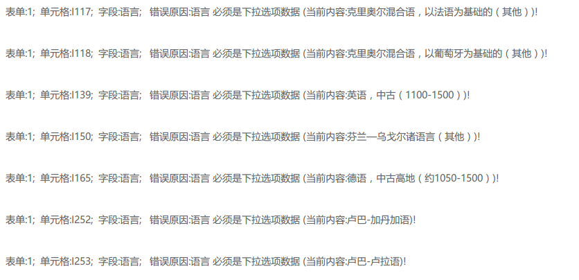
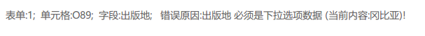

### 一、图书

1. 语种（如下图书语种类型存在于元数据规范，但无法通过检测）
2. 产品形式（如下图书产品形式存在于元数据规范，但无法通过检测）
3. 出版地检测（如下图书出版地存在于元数据规范，但无法通过检测）                         

### 二、音像

1. 语言（如下音像语言类型存在于元数据规范，但无法通过检测）

2. 类型（如下音像类型存在于元数据规范，但无法通过检测）                           

3. 样品容量（输入超过10个字符去检测，应提示最多输入10个字符类似提示语）                                                       

   

### 三、期刊

1. 出版地（如下出版地存在于元数据规范，但无法通过检测）                                                    
2. 分类号（如下期刊分类号存在于元数据规范，但无法通过检测）                                     
3. 期刊文种（如下期刊文种存在于元数据规范，但无法通过检测）
4. 期数（当年份小于1900时，检测也能通过，实际输入年份需大于1900）

### 四、报纸

1. 发行范围（如下报纸发行范围存在于元数据规范，但无法通过检测）              
2. 语种（如下报纸语种存在于元数据规范，但无法通过检测）
3. 出版地（如下报纸出版地存在于元数据规范，但无法通过检测）                                         
4. 期数（当年份小于1900时，检测也能通过，实际输入年份需大于1900）

PS：每次修改完数据文件后都要重新导入，为啥不可以直接导入文件路径，然后加个重新检测啥的==、~