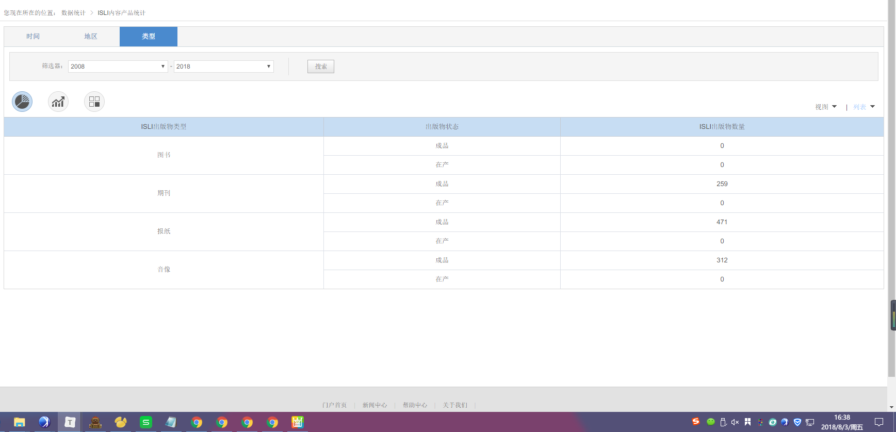
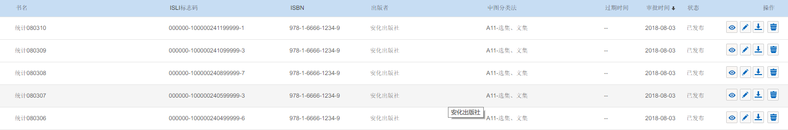
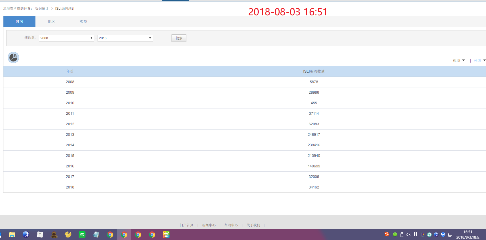
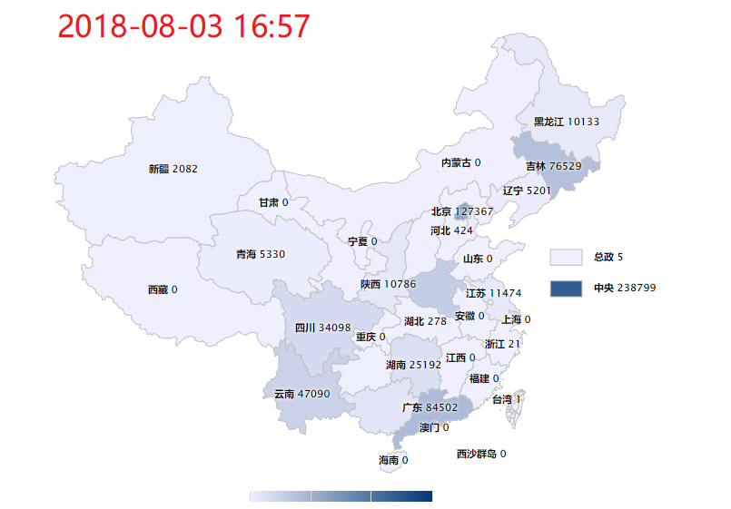
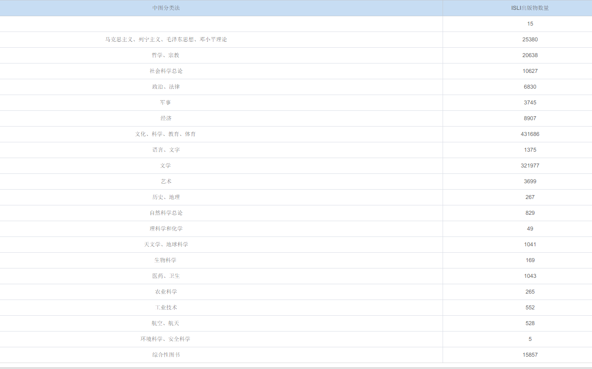
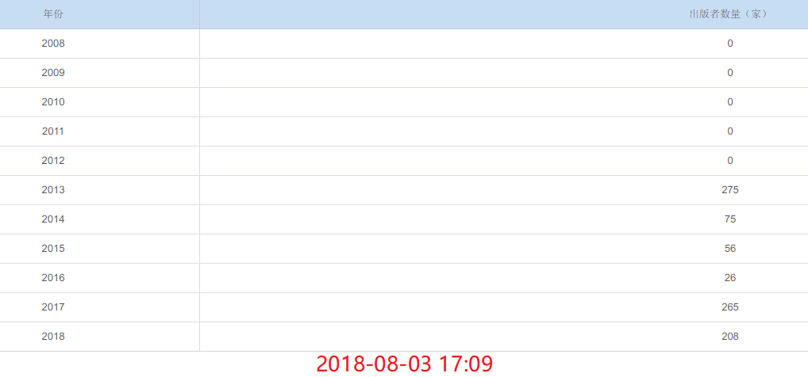

# 一、ISLI内容产品统计

## 时间

1. 2018年为何=0？

## 地区

1. 为什么地区却显示的出版者数量？

## 类型

1. 获取当前图书类型统计数据（时间点 2018-08-03 16:38）
2. 申请10条ISLI图书标志码，操作5条至制作中，5条至已发布
   - 制作中
   - 已发布
3. 过1个小时，观察类型统计数据，是否变化

# 二、ISLI编码统计

## 时间

1. 获取初始时间统计数据（2018数据：34162）

   

2. 查看ISLI编码管理，确认有新的ISLI编码生成

3. 过1个小时后，观察时间统计数据是否变化

## 地区

1. 获取初始地区统计数据
2. 查看ISLI编码管理，确认有新的ISLI编码生成
3. 过1个小时后，观察地区统计数据是否变化

### 类型

1. 数值（无数据）
2. 趋势（无数据）
3. 中图分类法
   - 记录初始中图法统计数据
   - 操作数据变化
   - 查看统计数据是否更新

# 三、ISLI Registrant统计

## 时间

1. 获取初始时间数据
2. 操作出版者数量
3. 查看统计数据是否更新

