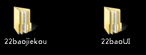

## 工作日志

### 2018-07-05	周四	

1. 配置工作环境；
2. 熟悉MPR注册中心产品文档；
3. 编写MPR注册中心-出版者业务管理系统脑图。

### 2018-07-06     周五    

1. 熟悉ISLI&MPR产品注册中心-图书类相关的业务流程；
2. 熟悉ISLI标志码与MPR前置码的关系，以及对应的状态变化；
3. 实际操作ISLI标志码与MPR前置码对应关系。

### 2018-07-09    周一    

1. 测试MPR前置码与ISLI对应状态关系，完成15种场景；        
2. 按石光雄分配的MPR&ISLI拆分测试任务计划测试；
3. 测试MPR注册中心图书相关功能与业务流程

### 2018-07-10    周二    

1. 测试MPR图书、期刊、报纸的前置码发放是否正确；
2. 测试MPR前置码申请、审批、撤销、废除等流程是否正常；
3. 测试MPR注册中心业务系统新界面

### 2018-07-11  周三    

1. 验证MPR图书、期刊、报纸的前置码发放是否正确；
2. 验证MPR前置码申请、修改、审核、撤销、废除、发布等流程是否正常；
3. 了解22包LR性能测试相关事项

### 2018-07-13     周五

1. 测试中国ISLI注册中心音频关联服务标志码发放是否正确；
2. 测试ISLI音频标志码申请、修改、审核、撤销、废除、发布等流程是否正常；
3. 提交ISLI注册中心BUG，3张

### 2018-07-16    周一

1. 测试中国ISLI注册中心音频关联服务
2. 熟悉中国ISLI元数据规范
3. 提交中国ISLI注册中心音频关联服务相关BUG，7张

### 2018-07-17    周二

1. 测试中国ISLI图书、期刊、音频关联服务；
2. 提交中国ISLI注册中心BUG，4张；
3. 关闭中国ISLI注册中心BUG，5张

### 2018-07-18    周三

1. 测试中国ISLI图书、期刊、音频关联服务；
2. 提交中国ISLI注册中心BUG，2张；
3. 修改中国ISLI注册中心BUG，2张；
4. 测试中国ISLI与MPR，修改元数据是否正常同步。

### 2018-07-19    周四

1. 回归中国ISLI注册中心BUG，6张，其中1张未通过；
2. 测试中国ISLI业务系统，图书、文献、音频等服务相关功能；
3. 测试ISLI标志码与MPR标志码状态同步。

### 2018-07-20     周五

1. 回归问题单7张，其中1张未通过；
2. 测试ISLI与MPR状态对应是否正常；
3. 测试MPR&ISLI注册中心业务流程。

### 2018-07-24    周二

1. 回归ISLI注册中心问题单，2张；
2. 测试ISLI注册中心导出相关功能；
3. 学习多媒体读物全流程操作（从申请到制作到发布）


## 工作记录

### 2018-07-09     周一

1. ~~MPR前台、后台修改制作中、已发布前置码信息，操作失败~~
2. ~~MPR申请管理页中-excel导出，导出文件中的审批意见与状态互相矛盾~~（已提单）
3. ~~ISLI后台无法进行撤销审批操作~~

### 2018-07-10    周二

1. ~~MPR审核中记录，前后台也无法修改原数据~~（已修复）
2. ~~MPR后台，出版者管理，无法修改出版者信息~~（未开发完成）
3. ~~MPR前置码无法申请~~（已修复）
4. ~~ISLI后台，报纸标志码管理，列表页展示ISLI标志码与详情页标志码校验位不一致~~（已提单）
5. ~~ISLI申请图书、音像标志码失败~~
6. ~~申请MPR期刊前置码，申请详情中期数会自动加上一个逗号~~（已提单）

### 2018-07-11     周三

1. ~~MPR报纸已发布状态下，前台修改元数据，点提交无反应~~

### 2018-07-13     周五

1. ~~ISLI音频关联标志码，前台，管理列表与查看详情页ISLI码显示错误（加04）~~
2. ~~审核中不是审批中~~
3. ~~ISLI撤销记录与废除记录没有数据（加04）~~

### 2018-07-16     周一

1. ~~ISLI前台，音频标志码（审核中），无法修改元数据，无法修改数据导致审批被拒后无法再次申请；~~
2. ~~ISLI前台， 申请ISLI音频标志码，ISRC输入无检测；~~
3. ~~ISLI前台，音频ISLI码管理，延期失败；~~
4. ~~音频-制作中，撤销失败；~~
5. ~~ISLI-音频-取消失败~~
6. ~~ISLI-音频，申请中ISLI编码数量为0也行？（编码数量为0时不能过审）~~

### 2018-07-17     周二

1. ~~中国ISLI业务系统，图书ISLI标志码申请，关键字元数据未检测用分号隔开；~~
2. ~~中国ISLI业务系统，图书、音像ISLI标志码管理，修改制作中状态的申请信息，过期时间消失，延期功能无效；~~
3. ~~中国ISLI后台，期刊、报纸SILI标志码管理，同意撤销审批失败；~~

### 2018-07-18    周三

1. ~~中国ISLI-P，其他文献ISLI码前后端不一致；~~（T21589）
2. ~~中国ISLI-P，其他文献，撤销与废除记录无数据；~~（T21597）
3. ~~中国ISLI-P，报纸，进入修改标志码信息页面时，期数会自动加上一个逗号~~（T21412）
4. ~~中国ISLI-P，视频关联服务，元数据首次出版与发行年份为非必填，这两个选项在没有填写的时候默认变成了0；~~（T21656）
5. ~~回归T21555、T21551、T21556、T21557问题单；~~（T21551等重构后验证排序）
6. ~~中国ISLI后台，图书、期刊、报纸同意撤销失败；~~
7. ISLI&MPR元数据修改是否同步
   - MPR：图书
     - ~~图书修改，ISLI查看~~
     - ISLI修改，图书查看（ISLI无法修改从MPR同步过来的申请信息）目测是ISLI服务阻碍导致的
   - MPR：期刊
     - ~~图书修改，ISLI查看~~
     - ~~ISLI修改，图书查看~~
8. ~~中国ISLI业务系统，先查看再点击返回，申请和导出以及状态统计不见了；~~（T21657）
   - [x] 图书/音像
   - [x] 期刊/报纸
9. ~~中国ISLI业务系统，期刊，ISSN在元数据规范里为非必填项？~~（ISLI必填，MPR非必填）

### 2018-07-19    周四

1. 回归问题单：
   - [x] T21635
   - [x] T21638
   - [x] T21617
   - [x] T21608
   - [x] T21589【标志码详情依旧错误，已知会开发，重构后验证】
   - [x] T21560
2. ~~中国ISLI业务系统，音像、期刊、报纸标志码撤销成功后，撤销记录中出版物类型错误；~~
   - 此问题关联至问题单：http://review.mprtimes.net/T21584
3. ~~ISLI其他文献，申请信息中作品类型子选项排序不对；~~（重构后已解决）
4. ~~ISLI申请图书，ISBN输入检测机制不完善，删除后重新输入即可跳过重复检测；~~（该功能还在开发中）
5. ~~测试ISLI操作与MPR状态对应关系，完成15种，暂无问题，结果标记在对应表上；~~
6. ~~中国ISLI后台，ISLI标志码审核-音频页面，审批中应为审核中；~~（已提单T21674）

### 2018-07-20    周五

1. 回归问题单：
   - [x] T21674
   - [x] T21657
   - [x] T21656
   - [ ] T21597（未通过，开发只修改了后台）
   - [x] T21589
   - [x] T21567
   - [x] T21482
2. ~~测试ISLI与MPR状态对应是否正常；~~
3. ~~中国ISLI业务系统，申请图书、音像标志码成功后，返回列表错误。（继续返回到了申请界面）；~~（T21680）
4. 中国ISLI后台，其他文献，19号申请记录审核不了；（历史数据不能审核？？？）
5. ~~中国ISLI后台，02、03、04服务标志码审核页面，序号异常；~~（T21681）;
6. ~~中国ISLI业务系统，成功申请视频标志码后，申请详情页异常~~；（T21682）
7. 中国ISLI后台，其他文献，重构后第一条撤销审批无法点击；（撤销原因空格太长？）

### 2018-07-23     周一

1. 回归问题单
   - [x] T21597
   - [x] T21680
2. ~~中国ISLI-P，期刊、报纸标志码在被废除后，废除列表中ISLI标志码自动改变且与后台管理系统不一致；~~（T21697）
3. ~~ISLI期刊标志码申请页，多出一个ISLI标志码数据项；~~（T21698）
4. ~~定价可以为0元吗？（阔以）；~~
5. ~~2、3、4服务废除列表缺少查看详情按钮；~~（T21699）
6. ~~ISLI标志码管理页，已发布图书、音像标志码数量字段名错误；~~（维持现状）

### 2018-07-24     周二

1. 回归问题单
   - [x] T21699
   - [x] T21682
   - [x] T21681
2. ~~中国ISLI业务系统，导出功能~~
   - 图书申请列表，无法按页码范围导出excel
   - 期刊申请列表，无法按页码范围导出excel
3. 新服02、03、04撤销与废除列表，出版物类型无数据；

### 2018-07-25     周三

1. ~~ISLI图书撤销记录，查看音像撤销记录详情，跳转到了视频ISLI码;~~（T21710）
2. ~~新服02、03、04撤销与废除列表，出版物类型无数据；~~（T21714）
3. ~~其他文献，标志码详情中审批时间优化；~~（T21718）
4. ~~ISLI后台，音像标志码审核列表，无法查看与修改申请；~~（T21721）
5. 回归问题单
   - [x] T21698
   - [x] T21714
   - [x] T21375
   - [x] T21697
   - [x] T21412
6. ~~ISLI业务系统，其他文献申请页，版本编号输入错误提示优化（可使用.分隔，使用其他符号分隔时应给出适当提示）；~~（pending）

### 2018-07-26    周四

1. 测试ISLI数据规范检查器

### 2018-07-27     周五

1. ~~ISLI-其他文献，注册者类型没有数据，前后台都没有；~~（T21721）
2. ~~ISLI-视频，每次进入修改信息页面都会重置定价为0；~~（未重现）
3. ~~MPR，期刊（制作中）、报纸（制作中第二次修改），后台，修改信息，期数会加逗号；~~（T21829）
4. ~~MPR后台期撤销与废除列表，期刊、报纸前置码缺少2位；~~（T21828）
5. ~~MPR后台，音像废除失败；~~（偶现）
6. 回归问题单：~~T21705~~  ~~T21710~~

### 2018-07-30    周一

1. 后台审核时只有一个弹窗提示，怎么体现出更新资料需要重新审核？

   - 资料更新前点击审核按钮，同时修改资料并保存以后，点击确定审核时，再弹出一个提示框，提示资料已变更

2. 新需求                                                                                                                   

3. ~~生成重复编码的问题解决了吗?~~（已解决）

4. ~~音像数据类型显示优化~~（T21885）

5. 考核

   - 本月加入MPR&ISLI项目组以来，我已经完成了如下计划和任务
     - 1.熟悉并了解MPR&ISLI注册系统，通过阅读项目相关设计、需求、历史问题单等相关资料了解注册中心业务流程；
     - 2.学习了本公司工作日志、工作周报等工作汇报编写方式；
     - 3.学习项目组质量管理系统PH的使用，已经可以独立查阅、编写、指派、高级搜索等PH提单全流程，本月已提单33个，已处理26个；
     - 4.学习并操作多媒体出版物发布全流程，从注册中心标志码申请、审核到maker中出版物的制作再到最后publisher上书籍的发布；
     - 5.如期完成了导师分配的测试任务

6. ~~ISLI后台，审核与管理页其他文献列表中，作品类型数据显示不全~~（T21889）

   

### 2018-07-31     周二

1. ISLI&MPR高仿环境信息
   - ISLI注册中心
     - 前台：https://islip.mpr.net.cn:8443/mpr/portal-mcrs-publisher/mvc/publisher/toLogin
     - 后台：https://islim.mpr.net.cn:18405/mpr/mcrs-system/mvc/syslogin/index （admin/islimpr123）
   - MPR注册中心：
     - 前台：https://mcrcp.mpr.net.cn:8443/mpr/portal-mcrs-publisher/mvc/publisher/toLogin
     - 后台：https://mcrcm.mpr.net.cn:8443/mpr/mcrs-system/mvc/syslogin/login
2. ISLI注册中心高仿测试
   -  前台图书管理，一键MPR被放在了独自一行
   - ISLI-期刊，审核报系统繁忙
   - ~~其他文献~~
     - 载体形式还是临时值
     - 作品类型子选项缺失
     - 注册者类型子选项缺失
3. 迭代计划1.2
   - [x] 中图法支持编号以及编号搜索
   - [x] 出版者注册信息，电子号（ISBN）第三段最长支持6位
   - [x] 申请图书ISLI标志码时，提示ISBN的重复使用
   - [ ] 标志码审核过程中，如果出版社更新数据，则提示管理员重新审核
4. 重要：视频标志码申请时，用的是音频的存储格式。

### 2018-08-01    周三

1. ~~视频标志码申请使用音频储存格式~~；（T21908）
2. ISLI高仿：
   - 前台管理页面，一键MPR操作按钮样式问题
   - 其他文献，注册者类型没有数据，（测试环境已提单T21721）
3. MPR高仿：
   - 期刊、报纸拒绝申请后再次申请，期数偶现逗号
   - 后台报纸、期刊废除记录列表MPR前置码少了两位（测试环境已提单T21828）
   - 


## 遗留问题

### 2018-07-05	周四

1. MPR编码与ISLI编码的关系

   ISLI是一种标识符

2. MPR项目中涉及到了哪些专项测试？是否有自动化、安全、性能等专项测试？

3. MPR的进度

   - MPR/ISLI注册系统拆分
   - 服务编码拆分

### 2018-07-6    周五

1. 申请mpr前置码会自动申请isli码，但是反之不成立的话，怎么构建出isli在制作中，然后mpr又在审核中的状态？申请isli不会自动申请mpr，那这两者是怎么对应起来的
   - 申请ISLI并审核以后，MPR会自动新增该对应记录

### 2018-07-09    周一

1. MPR前置码以及ISLI码多久逾期？

   - 过期时间在管理列表有啊！！！
   - 测试一般的过期时间是1天

2. 一本书上怎么铺多个码？

   一本书上多个码是指ISLI码中间部分倒数后五位的变化，这五位代表一本书里的不同多媒体信息，最大值即一本书里最多能放置的多媒体信息

### 2018-07-10     周二

1. ISBN怎么确定？

   参见MPR项目资料-元数据规范


## 项目相关

### 1.ISLI标志码与MPR前置码特例

#### 3.0-ISLI

| 编号 | 前置条件 |        | 操作         | 结果     |             | 测试结果 | 测试时间   |
| ---- | :------- | ------ | ------------ | -------- | ----------- | -------- | ---------- |
| 1    | ISLI     | MPR    | ISLI操作     | ISLI结果 | MPR对应结果 |          |            |
| 2    | 制作中   | 无状态 | 撤销         | 已撤销   | 无状态      | pass     | 2018-07-09 |
| 3    | 制作中   | 审核中 | 撤销         | 已撤销   | 已取消      |          |            |
| 4    | 制作中   | 未通过 | 撤销         | 已撤销   | 已取消      |          |            |
| 5    | 制作中   | 已取消 | 撤销         | 已撤销   | 已取消      |          |            |
| 6    | 制作中   | 制作中 | 撤销         | 已撤销   | 已撤销      |          |            |
| 7    | 制作中   | 已过期 | 撤销         | 已撤销   | 已撤销      |          |            |
| 8    | 制作中   | 撤销中 | 撤销         | 已撤销   | 已撤销      |          |            |
| 9    | 制作中   | 已撤销 | 撤销         | 已撤销   | 已撤销      |          |            |
| 10   | 制作中   | 无状态 | 一键MPR      | 制作中   | 制作中      | pass     | 2018-07-09 |
| 11   | 已发布   | 无状态 | 废除         | 已废除   | 无状态      | pass     | 2018-07-09 |
| 12   | 已发布   | 审核中 | 废除         | 已废除   | 已取消      | pass     | 2018-07-09 |
| 13   | 已发布   | 未通过 | 废除         | 已废除   | 未通过      | pass     | 2018-07-09 |
| 14   | 已发布   | 已取消 | 废除         | 已废除   | 已取消      | pass     | 2018-07-09 |
| 15   | 已发布   | 制作中 | 废除         | 已废除   | 已撤销      | pass     | 2018-07-09 |
| 16   | 已发布   | 已发布 | 废除         | 已废除   | 已发布      | pass     | 2018-07-09 |
| 17   | 已发布   | 已过期 | 废除         | 已废除   | 已过期      |          |            |
| 18   | 已发布   | 撤销中 | 废除         | 已废除   | 撤销中      | pass     | 2018-07-09 |
| 19   | 已发布   | 已撤销 | 废除         | 已废除   | 已撤销      | pass     | 2018-07-09 |
| 20   | 已发布   | 已废除 | 废除         | 已废除   | 已废除      | pass     | 2018-07-09 |
| 21   | 撤销中   | 无状态 | 审批通过撤销 | 已撤销   | 无状态      | pass     | 2018-07-09 |
| 22   | 撤销中   | 审核中 | 审批通过撤销 | 已撤销   | 已取消      |          |            |
| 23   | 撤销中   | 未通过 | 审批通过撤销 | 已撤销   | 已取消      |          |            |
| 24   | 撤销中   | 已取消 | 审批通过撤销 | 已撤销   | 已取消      |          |            |
| 25   | 撤销中   | 已过期 | 审批通过撤销 | 已撤销   | 已撤销      |          |            |
| 26   | 撤销中   | 撤销中 | 审批通过撤销 | 已撤销   | 已撤销      |          |            |
| 27   | 撤销中   | 已撤销 | 审批通过撤销 | 已撤销   | 已撤销      |          |            |
| 28   | 未通过   | 无状态 | 再次审核     | 审核中   | 无状态      |          |            |
| 29   | 未通过   | 未通过 | 再次审核     | 审核中   | 未通过      |          |            |
| 30   | 未通过   | 已取消 | 再次审核     | 审核中   | 已取消      |          |            |
| 31   | 审核中   | 无状态 | 未通过       | 未通过   | 无状态      |          |            |
| 32   | 审核中   | 审核中 | 未通过       | 未通过   | 未通过      |          |            |
|      |          |        |              |          |             |          |            |
|      |          |        |              |          |             |          |            |

3.0-MPR

### 2.ISRC新旧数据

- ISLI元数据中有一个ISRC数据项（录音制品编码）
  - 老版本数据是五段
  - 新版本数据是四段
  - 新版本只能申请和修改四段的数据
  - 新版本要能查看五段老数据

### 3.测试新数据是否可用

- 服务编码的拆分使第一段编码由0变成了0-4，五种
- 下载新的授权文件，测试在maker那边是否能够正常识别

### 4.全流程数据兼容测试关注点

- 新版maker能正常导入授权文件
- 旧版maker能正常导入旧的授权文件
- publisher发布后，注册中心后台“ISLI编码管理”能查看到编码数据
- 新的ISLI编码在官网能正常解析

## 软件使用

### 1.typora快捷键

```
- 无序列表：输入-之后输入空格
- 有序列表：输入数字+“.”之后输入空格
- 任务列表：-[空格]空格 文字
- 标题：ctrl+数字
- 表格：ctrl+t
- 生成目录：[TOC]按回车
- 选中一整行：ctrl+l
- 选中单词：ctrl+d
- 选中相同格式的文字：ctrl+e
- 跳转到文章开头：ctrl+home
- 跳转到文章结尾：ctrl+end
- 搜索：ctrl+f
- 替换：ctrl+h
- 引用：输入>之后输入空格
- 代码块：ctrl+alt+f
- 加粗：ctrl+b
- 倾斜：ctrl+i
- 下划线：ctrl+u
- 删除线：alt+shift+5
- 插入图片：直接拖动到指定位置即可或者ctrl+shift+i
- 插入链接：ctrl+k
```

### 2.pip安装命令（清华源）

```
    pip  install --index https://pypi.mirrors.ustc.edu.cn/simple/ robotframework-ExcelLibrary
    #注意，simple后面跟包名，记得要用空格隔开
```

### 3.selenium2Library问题

- 要把子目录selenium2Library剪切到site-pakages路径下，不然一直导入不进去

### 4.制作RF启动icon

- 桌面创建快捷方式并输入

  ```
  C:\Python27\pythonw.exe -c "from robotide import main;main()";
  ```

- 替换logo路径

  ```
  C:\Python27\Lib\site-packages\robotide\widgets
  ```

### 5.wxPython在Windows10上安装的问题

- 在win10上安装了64位依旧无法使用
- 解决办法：安装32位~

### 6.SVN-不知道这样的主机

- host文件没有重定向域名的真实IP，加上就可以了

### 7.python导出已安装的拓展包文件

- 导出：pip freeze > D:\requirements.txt
- 安装：pip install -r requirements.txt

### 8.SVN cleanup不成功

- 首先下载sqlite3.exe放到需要cleanup的svn目录下
- 然后进入此目录cmd，输入  sqlite3 .svn/wc.db "delete from work_queue"（清除队列）
- 最后执行cleanup即可
- 如果还是不能cleanup，输入  sqlite3 .svn/wc.db "delete from wc_lock"

### 9.常用正则匹配表达式

- https://blog.csdn.net/AGambler/article/details/78831192

- 匹配全部html标签

  ```
  <(S*?)[^>]*>.*?|<.*? />
  ```

- 匹配全部空行

  ```
  ^\s+
  ```

- 


## 工作相关

### 1.测试SVN地址

http://172.16.6.39:8443/svn/test

### 2.账号信息

- ISLI出版者业务管理系统：liyh@mpreader.com	lin123456

### 3.BUG提交注意事项

- 新建自定义查询并保存

- 新建bug

  

- 新建bug需要加标签

  

  


### 4.MPR前置码申请信息

- 期刊
  - ISSN：1111-1119 
  - CN：12-2345-T
  - ISBN：978-1-6666-1234-9

### 5.22包性能测试

1. 测试机登录信息

   - win+r  输入 mstsc
   - 远程地址：172.16.7.129
   - 账号密码：Test1010win7  123

2. 性能标准

   1000万数据，1000并发，时间500ms

3. 已录制好的LR脚本

   

4. 1000个ISBN码

   

5. 

### 6.本机配置信息

- IP：172.16.7.162
- 子网掩码：255.255.255.0
- 网关：172.16.7.253
- DNS：180.76.76.76

### 7.回归BUG

- 回归测试通过，ISLI&MPR注册系统拆分--svn0829 


