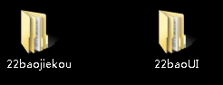

## 工作日志

### 2018-07-05	周四	

1. 配置工作环境；
2. 熟悉MPR注册中心产品文档；
3. 编写MPR注册中心-出版者业务管理系统脑图。

### 2018-07-06     周五    

1. 熟悉ISLI&MPR产品注册中心-图书类相关的业务流程；
2. 熟悉ISLI标志码与MPR前置码的关系，以及对应的状态变化；
3. 实际操作ISLI标志码与MPR前置码对应关系。

### 2018-07-09    周一    

1. 测试MPR前置码与ISLI对应状态关系，完成15种场景；
2. 按石光雄分配的MPR&ISLI拆分测试任务计划测试；
3. 测试MPR注册中心图书相关功能与业务流程

### 2018-07-10    周二    

1. 测试MPR图书、期刊、报纸的前置码发放是否正确；
2. 测试MPR前置码申请、审批、撤销、废除等流程是否正常；
3. 测试MPR注册中心业务系统新界面

### 2018-07-11  周三    

1. 验证MPR图书、期刊、报纸的前置码发放是否正确；
2. 验证MPR前置码申请、修改、审核、撤销、废除、发布等流程是否正常；
3. 了解22包LR性能测试相关事项

### 2018-07-13     周五

1. 测试中国ISLI注册中心音频关联服务标志码发放是否正确；
2. 测试ISLI音频标志码申请、修改、审核、撤销、废除、发布等流程是否正常；
3. 提交ISLI注册中心BUG，3张

## 遗留问题

### 2017-07-05	周四

1. MPR编码与ISLI编码的关系

   ISLI是一种标识符

2. MPR项目中涉及到了哪些专项测试？是否有自动化、安全、性能等专项测试？

3. MPR的进度

   - MPR/ISLI注册系统拆分
   - 服务编码拆分

### 2017-07-6    周五

1. 申请mpr前置码会自动申请isli码，但是反之不成立的话，怎么构建出isli在制作中，然后mpr又在审核中的状态？申请isli不会自动申请mpr，那这两者是怎么对应起来的
   - 申请ISLI并审核以后，MPR会自动新增该对应记录

### 2017-07-09    周一

1. MPR前置码以及ISLI码多久逾期？
   - 过期时间在管理列表有啊！！！
   - 测试一般的过期时间是1天

2. 一本书上怎么铺多个码？

   一本书上多个码是指ISLI码中间部分倒数后五位的变化，这五位代表一本书里的不同多媒体信息，最大值即一本书里最多能放置的多媒体信息

### 2017-07-10     周二

1. ISBN怎么确定？

   参见MPR项目资料-元数据规范


## 待办

### 2017-07-16

- 确认ISLI-音频标志码过期状态是否正确（已申请名为“过期”标志码）

## 项目相关

### 1.ISLI标志码与MPR前置码特例

#### 3.0-ISLI

| 编号 | 前置条件 |        | 操作         | 结果     |             | 测试结果 | 测试时间   |
| ---- | :------- | ------ | ------------ | -------- | ----------- | -------- | ---------- |
| 1    | ISLI     | MPR    | ISLI操作     | ISLI结果 | MPR对应结果 |          |            |
| 2    | 制作中   | 无状态 | 撤销         | 已撤销   | 无状态      | pass     | 2018-07-09 |
| 3    | 制作中   | 审核中 | 撤销         | 已撤销   | 已取消      |          |            |
| 4    | 制作中   | 未通过 | 撤销         | 已撤销   | 已取消      |          |            |
| 5    | 制作中   | 已取消 | 撤销         | 已撤销   | 已取消      |          |            |
| 6    | 制作中   | 制作中 | 撤销         | 已撤销   | 已撤销      |          |            |
| 7    | 制作中   | 已过期 | 撤销         | 已撤销   | 已撤销      |          |            |
| 8    | 制作中   | 撤销中 | 撤销         | 已撤销   | 已撤销      |          |            |
| 9    | 制作中   | 已撤销 | 撤销         | 已撤销   | 已撤销      |          |            |
| 10   | 制作中   | 无状态 | 一键MPR      | 制作中   | 制作中      | pass     | 2018-07-09 |
| 11   | 已发布   | 无状态 | 废除         | 已废除   | 无状态      | pass     | 2018-07-09 |
| 12   | 已发布   | 审核中 | 废除         | 已废除   | 已取消      | pass     | 2018-07-09 |
| 13   | 已发布   | 未通过 | 废除         | 已废除   | 未通过      | pass     | 2018-07-09 |
| 14   | 已发布   | 已取消 | 废除         | 已废除   | 已取消      | pass     | 2018-07-09 |
| 15   | 已发布   | 制作中 | 废除         | 已废除   | 已撤销      | pass     | 2018-07-09 |
| 16   | 已发布   | 已发布 | 废除         | 已废除   | 已发布      | pass     | 2018-07-09 |
| 17   | 已发布   | 已过期 | 废除         | 已废除   | 已过期      |          |            |
| 18   | 已发布   | 撤销中 | 废除         | 已废除   | 撤销中      | pass     | 2018-07-09 |
| 19   | 已发布   | 已撤销 | 废除         | 已废除   | 已撤销      | pass     | 2018-07-09 |
| 20   | 已发布   | 已废除 | 废除         | 已废除   | 已废除      | pass     | 2018-07-09 |
| 21   | 撤销中   | 无状态 | 审批通过撤销 | 已撤销   | 无状态      | pass     | 2018-07-09 |
| 22   | 撤销中   | 审核中 | 审批通过撤销 | 已撤销   | 已取消      |          |            |
| 23   | 撤销中   | 未通过 | 审批通过撤销 | 已撤销   | 已取消      |          |            |
| 24   | 撤销中   | 已取消 | 审批通过撤销 | 已撤销   | 已取消      |          |            |
| 25   | 撤销中   | 已过期 | 审批通过撤销 | 已撤销   | 已撤销      |          |            |
| 26   | 撤销中   | 撤销中 | 审批通过撤销 | 已撤销   | 已撤销      |          |            |
| 27   | 撤销中   | 已撤销 | 审批通过撤销 | 已撤销   | 已撤销      |          |            |
| 28   | 未通过   | 无状态 | 再次审核     | 审核中   | 无状态      |          |            |
| 29   | 未通过   | 未通过 | 再次审核     | 审核中   | 未通过      |          |            |
| 30   | 未通过   | 已取消 | 再次审核     | 审核中   | 已取消      |          |            |
| 31   | 审核中   | 无状态 | 未通过       | 未通过   | 无状态      |          |            |
| 32   | 审核中   | 审核中 | 未通过       | 未通过   | 未通过      |          |            |
|      |          |        |              |          |             |          |            |
|      |          |        |              |          |             |          |            |

#### 3.0-MPR

## 软件使用

### 1.typora快捷键

```
- 无序列表：输入-之后输入空格
- 有序列表：输入数字+“.”之后输入空格
- 任务列表：-[空格]空格 文字
- 标题：ctrl+数字
- 表格：ctrl+t
- 生成目录：[TOC]按回车
- 选中一整行：ctrl+l
- 选中单词：ctrl+d
- 选中相同格式的文字：ctrl+e
- 跳转到文章开头：ctrl+home
- 跳转到文章结尾：ctrl+end
- 搜索：ctrl+f
- 替换：ctrl+h
- 引用：输入>之后输入空格
- 代码块：ctrl+alt+f
- 加粗：ctrl+b
- 倾斜：ctrl+i
- 下划线：ctrl+u
- 删除线：alt+shift+5
- 插入图片：直接拖动到指定位置即可或者ctrl+shift+i
- 插入链接：ctrl+k
```

### 2.pip安装命令（清华源）

```
    pip  install --index https://pypi.mirrors.ustc.edu.cn/simple/ + 包名
```

### 3.selenium2Library问题

- 要把子目录selenium2Library剪切到site-pakages路径下，不然一直导入不进去

### 4.制作RF启动icon

- 桌面创建快捷方式并输入

  ```
  C:\Python27\pythonw.exe -c "from robotide import main;main()";
  ```

- 替换logo路径

  ```
  C:\Python27\Lib\site-packages\robotide\widgets
  ```

### 5.wxPython在Windows10上安装的问题

- 在win10上安装了64位依旧无法使用
- 解决办法：安装32位~

## 工作相关

### 1.测试SVN地址

http://172.16.6.39:8443/svn/test

### 2.账号信息

- ISLI出版者业务管理系统：liyh@mpreader.com	lin123456

### 3.BUG提交注意事项

- 新建自定义查询并保存

- 新建bug

  

- 新建bug需要加标签

  

- 

  

### 4.MPR前置码申请信息

- 期刊
  - ISSN：1111-1119 
  - CN：12-2345-T
  - ISBN：978-1-6666-1234-9

### 5.22包性能测试

1. 测试机登录信息

   - win+r  输入 mstsc
   - 远程地址：172.16.7.129
   - 账号密码：Test1010win7  123

2. 性能标准

   1000万数据，1000并发，时间500ms

3. 已录制好的LR脚本

   

4. 1000个ISBN码

   

5. 

### 6.本机配置信息

- IP：172.16.7.162
- 子网掩码：255.255.255.0
- 网关：172.16.7.253
- DNS：180.76.76.76
- 

## 测试日志

### 2017-07-11    周三

#### MPR注册中心

1. 图书前置码

   - 前台
     - 申请列表
       - [x] 查看
       - [x] 修改
       - [x] 取消
       - [x] 再次申请
     - 管理列表
       - [x] 查看
       - [x] 修改
       - [x] 延期
       - [x] 下载
       - [x] 申请撤销
   - 后台
     - 审核列表
       - [x] 查看
       - [x] 修改
       - [x] 审核
       - [x] 拒绝
     - 管理列表
       - [x] 查看
       - [x] 修改
       - [x] 延期
       - [x] 下载
       - [x] 撤销
       - [x] 发布
       - [x] 废除
2. 期刊前置码

   - 前台
     - 申请列表
       - [x] 查看
       - [x] 修改
       - [x] 取消
       - [x] 再次申请
     - 管理列表
       - [x] 查看
       - [x] 修改
       - [x] 延期
       - [x] 下载
       - [x] 申请撤销
   - 后台
     - 审核列表
       - [x] 查看
       - [x] 修改
       - [x] 审核
       - [x] 拒绝
     - 管理列表
       - [x] 查看
       - [x] 修改
       - [x] 延期
       - [x] 下载
       - [x] 撤销审批
       - [x] 发布
       - [x] 废除
3. 报纸前置码

   - 前台
     - 申请列表
       - [x] 查看
       - [x] 修改
       - [x] 取消
       - [x] 再次申请
     - 管理列表
       - [x] 查看
       - [x] 修改
       - [x] 延期
       - [x] 下载
       - [x] 申请撤销
   - 后台
     - 审核列表
       - [x] 查看
       - [x] 修改
       - [x] 审核
       - [x] 拒绝
     - 管理列表
       - [x] 查看
       - [x] 修改
       - [x] 延期
       - [x] 下载
       - [x] 撤销审批
       - [x] 发布
       - [x] 废除
4. 修改申请操作（前后台）

   - MPR图书前置码

     - [x] 审核中
     - [x] 制作中
     - [x] 已发布

   - MPR期刊前置码

     - [x] 审核中
     - [x] 制作中
     - [x] 已发布

   - MPR报纸前置码

     - [x] 审核中
     - [x] 制作中
     - [ ] 已发布（前台修改不了）

### 2017-07-13    周五

#### ISLI注册中心

音频关联服务

- 前台
  - 申请列表
    - [x] 查看
    - [x] 修改
    - [x] 取消
    - [x] 再次申请
    - [x] 列表顶部状态统计
    - [ ] 筛选功能
  - 管理列表
    - [x] 查看
    - [x] 修改
    - [x] 延期
    - [x] 下载
    - [x] 申请撤销
    - [x] 列表顶部状态统计
    - [ ] 筛选功能
- 后台
  - 审核列表
    - [x] 查看
    - [x] 修改
    - [x] 审核
    - [x] 拒绝
    - [ ] 筛选功能
  - 管理列表
    - [x] 查看
    - [x] 修改
    - [x] 延期
    - [x] 下载
    - [x] 撤销
    - [x] 发布
    - [x] 废除
    - [ ] 筛选功能


## BUG记录

### 2017-07-09

1. ~~MPR前台、后台修改制作中、已发布前置码信息，操作失败~~
2. ~~MPR申请管理页中-excel导出，导出文件中的审批意见与状态互相矛盾~~（已提单）
3. ~~ISLI后台无法进行撤销审批操作~~

### 2017-07-10

1. ~~MPR审核中记录，前后台也无法修改原数据~~（已修复）
2. ~~MPR后台，出版者管理，无法修改出版者信息~~（未开发完成）
3. ~~MPR前置码无法申请~~（已修复）
4. ~~ISLI后台，报纸标志码管理，列表页展示ISLI标志码与详情页标志码校验位不一致~~（已提单）
5. ~~ISLI申请图书、音像标志码失败~~
6. ~~申请MPR期刊前置码，申请详情中期数会自动加上一个逗号~~（已提单）

### 2017-07-11

1. MPR报纸已发布状态下，前台修改元数据，点提交无反应

### 2017-07-13

1. ~~ISLI音频关联标志码，前台，管理列表与查看详情页ISLI码显示错误（加04）~~

2. ~~审核中不是审批中~~

3. ~~ISLI撤销记录与废除记录没有数据（加04）~~

   


